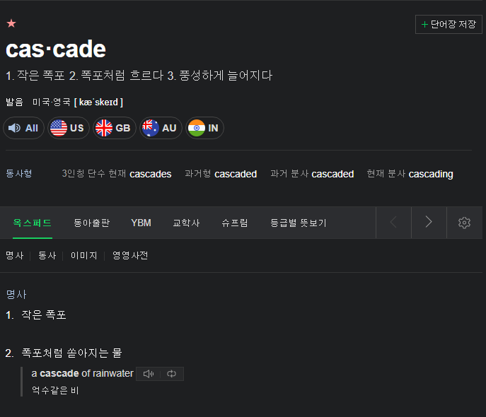
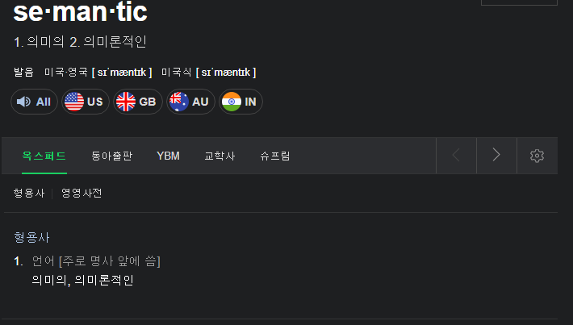
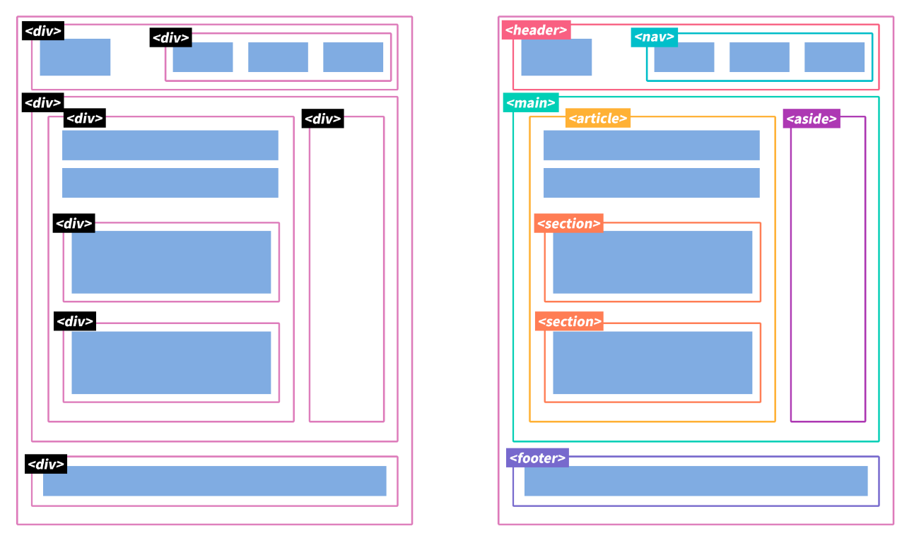

# Week.1 Weekly Paper

🙋‍♂️Author: Heedong0924

original source: [더 깔끔한 노션 페이지](https://mammoth-sodium-807.notion.site/Week-1-Weekly-Paper-1ccaa082e036808da4b2ec4254e5d875?pvs=74)

# ❓CSS의 Cascading에 대해 설명해주세요.

## 1. Cascade의 의미

CSS는 Cascading StyleSheet의 약어이다.

직관적으로 해석하면 casecade 하는 스타일 시트라는 의미로 보인다. cascade의 의미는 무엇일까?



_source: [*https://en.dict.naver.com/#/entry/enko/404e7935c8494e448e4991c5096de246*](https://en.dict.naver.com/#/entry/enko/404e7935c8494e448e4991c5096de246)_

**cascade**는 “작은 폭포” 혹은 “폭포처럼 흐른다”는 의미를 가지고 있다.

즉, CSS(Cascading StyleSheet)는 폭포처럼 흐르는 스타일 시트를 의미한다는 것을 유추할 수 있다.

그렇다면, CSS의 어떠한 특징이 사용자에게 있어 폭포를 연상시키는지 조사해보자.


## 2. CSS Cascade

CSS에서 말하는 cascading이란 스타일 규칙 및 선언이 적용되는 방식 그리고 그 중에서 규칙 및 우선 순위에 대한 프로세스를 의미한다.

일반적으로 프로그래밍의 세계에서 정의는 중복을 허용하지 않는 경우가 많다.

그러나 스타일 시트를 작성하게 되면 같은 태그나 같은 클래스에 대한 스타일 규칙이 겹치는 경우가 발생한다.

그리고 하나의 스타일 속성 값이 서로 다른 선언에서 다른 정의를 가질 수도 있다.

목적에 따라 중복을 허용하는 선언이 존재할 수 있지만, 컴퓨터가 결과를 출력하기 위해 적용하는 값은 하나만 적용된다.

따라서, 선언된 여러 정의들 중 **하나를 선택하는 규칙**이 필요한 것이다.

## 3. Cascading의 핵심 개념

### 3-1 원천 유형(Origin type)

- **사용자 에이전트 스타일 시트(User-Agent StyleSheet)**: 브라우저 자체가 제공하는 기본적인 스타일시트
- **개발자가 만든 스타일 시트(Author StyleSheet)**: 개발자 혹은 디자이너가 정의한 스타일 규칙이 포함된 스타일 시트 (가장 일반적인 유형의 스타일 시트이다.)
- **웹 사이트 사용자가 만든 스타일 시트(User StyleSheet)**: 사용자가 브라우저 설정에서 직접 정의한 스타일 시트
  Origin에 따른 일반적인 CSS 우선순위는 다음과 같다.

**Author StyleSheet > User StyleSheet > User-Agnet StyleSheet**

### 3-1-1 다양하게 표현되는 Author Style

우리가 가장 많이 접하게 될 Author Style에 대해 조금 더 자세히 알아보자.

하나의 HTML 파일을 만들고, 해당 파일에 CSS 스타일을 적용하는 방법은 다양하다.

- **인라인 스타일(Inline style)**: HTML 요소 내에 직접적으로 적용된 스타일 방식
  `<h1 syle=”color: #00000”>hello world!</h1>`

- **내부 스타일 시트(Internal style sheet)**: HTML 문서 내의 `<head>` 태그에 `<style>` 태그를 사용하여 CSS 스타일을 적용하는 방식

```html
<head>
  <style>
    body {
      background-color: #ffff00;
    }
    h2 {
      color: blue;
    }
  </style>
</head>
```

- **외부 스타일 시트(External style sheet)**: HTML 문서 외부의 스타일 시트 파일을 참조하여 CSS 스타일을 적용하는 방식

```html
<head>
  <link rel="stylesheet" href="./styles/style.css" />
</head>
```

Author Style에 따른 일반적인 CSS 우선순위는 다음과 같다.

**Inline Style > Internal StyleSheet > External StyleSheet**

### 3-2 명시도(Specificity)에 따른 우선순위

> _source: [*https://developer.mozilla.org/ko/docs/Web/CSS/CSS_cascade/Specificity*](https://developer.mozilla.org/ko/docs/Web/CSS/CSS_cascade/Specificity)_
>
> # **명시도**
>
> **명시도**란 브라우저가 어느 요소와 가장 연관된 속성을 찾는 수단으로, 이렇게 찾은 속성이 해당 요소에 적용됩니다. 명시도는 여러 종류의 [CSS 선택자](https://developer.mozilla.org/ko/docs/Web/CSS/Reference#selectors)로 구성된 일치 규칙에 기반합니다.
>
> # [**어떻게 계산되는가?**](https://developer.mozilla.org/ko/docs/Web/CSS/CSS_cascade/Specificity#%EC%96%B4%EB%96%BB%EA%B2%8C_%EA%B3%84%EC%82%B0%EB%90%98%EB%8A%94%EA%B0%80)
>
> 명시도는 주어진 CSS 선언에 적용되는 가중치(weight)로, 일치하는 선택자 내 각 [선택자 유형](https://developer.mozilla.org/ko/docs/Web/CSS/CSS_cascade/Specificity#selector-type)의 수에 의해 결정됩니다. 여러 선언이 명시도가 같은 경우, CSS에서 맨 끝에 오는 선언이 요소에 적용됩니다. 명시도는 같은 요소가 여러 선언의 대상이 되는 경우에만 적용합니다. CSS 규칙에 따라 [직접 대상 요소](https://developer.mozilla.org/ko/docs/Web/CSS/CSS_cascade/Specificity#directly-targeted-elements)는 요소가 부모로부터 상속받는 규칙보다 항상 우선합니다.
>
> 명시도는 주어진 CSS 선언에 적용되는 가중치(weight)로, 일치하는 선택자 내 각 [선택자 유형](https://developer.mozilla.org/ko/docs/Web/CSS/CSS_cascade/Specificity#selector-type)의 수에 의해 결정됩니다. 여러 선언이 명시도가 같은 경우, CSS에서 맨 끝에 오는 선언이 요소에 적용됩니다. 명시도는 같은 요소가 여러 선언의 대상이 되는 경우에만 적용합니다. CSS 규칙에 따라 [직접 대상 요소](https://developer.mozilla.org/ko/docs/Web/CSS/CSS_cascade/Specificity#directly-targeted-elements)는 요소가 부모로부터 상속받는 규칙보다 항상 우선합니다.

명시도(Specificity)에서 분류되는 선택자 유형은 다음과 같다.

- **ID 선택자(**`**#example**`** 등)**
- **Class 선택자(**`**.example**`** 등) 가상 클래스 선택자(**`**:hover**`**) 등**
- **Type 선택자(**`**h1**`** 등)**
  선택자 유형 따른 CSS 우선순위는 다음과 같다.

**ID 카테고리 > CLASS 카테고리 > TYPE 카테고리**

또한, 위 선택자는 유형별로 명시도의 특정성을 증가시킨다.

id, class, type을 구분지어 0-0-0-0과 같은 방식으로 각각의 유형별 명시도 특정성이 증가하는 것이다.

디테일한 명시도 특정성(구체성) 값의 규칙 적용 방식은 아래와 같다.

> [https://codingeverybody.kr/css-%EC%84%A0%ED%83%9D%EC%9E%90%EC%9D%98-%EA%B5%AC%EC%B2%B4%EC%84%B1-%EA%B0%92/](https://codingeverybody.kr/css-%EC%84%A0%ED%83%9D%EC%9E%90%EC%9D%98-%EA%B5%AC%EC%B2%B4%EC%84%B1-%EA%B0%92/)
>
> ## **CSS 선택자의 구체성 값의 규칙**
>
> - 구체성의 값은 0,0,0,0 처럼 4개의 부분 값으로 표현되어 다음과 같이 계산됩니다.
> - 선택자에 있는 모든 [`#`](https://codingeverybody.kr/css-id-selector/)[`*id*`](https://codingeverybody.kr/css-id-selector/)[ 선택자](https://codingeverybody.kr/css-id-selector/)에 0,1,0,0 값이 추가됩니다.
> - 선택자에 있는 모든 [`.`](https://codingeverybody.kr/css-class-selector/)[`*class*`](https://codingeverybody.kr/css-class-selector/)[ 선택자](https://codingeverybody.kr/css-class-selector/), 가상 클래스([`:first-child`](https://codingeverybody.kr/css-first-child-%ea%b0%80%ec%83%81-%ed%81%b4%eb%9e%98%ec%8a%a4-%ec%82%ac%ec%9a%a9-%eb%b0%a9%eb%b2%95/), [`:last-child`](https://codingeverybody.kr/css-last-child-%ea%b0%80%ec%83%81-%ed%81%b4%eb%9e%98%ec%8a%a4-%ec%82%ac%ec%9a%a9-%eb%b0%a9%eb%b2%95/), [`:focus`](https://codingeverybody.kr/css-focus-%ea%b0%80%ec%83%81-%ed%81%b4%eb%9e%98%ec%8a%a4/), [`:active`](https://codingeverybody.kr/css-active-%ea%b0%80%ec%83%81-%ed%81%b4%eb%9e%98%ec%8a%a4/), [`:visited`](https://codingeverybody.kr/css-visited-%ea%b0%80%ec%83%81-%ed%81%b4%eb%9e%98%ec%8a%a4/), [`:hover`](https://codingeverybody.kr/css-hover-%ea%b0%80%ec%83%81-%ed%81%b4%eb%9e%98%ec%8a%a4/), [`::selection`](https://codingeverybody.kr/css-selection-%ea%b0%80%ec%83%81-%ec%9a%94%ec%86%8c-%ec%84%a0%ed%83%9d%ec%9e%90/) 등) 선택자, 기타 속성 선택자에 0,0,1,0 값이 추가됩니다.
> - 선택자에 있는 [요소 이름 선택자](https://codingeverybody.kr/css-tag-name-selector/)와 가상요소([`::before`](https://codingeverybody.kr/css-before-%ea%b0%80%ec%83%81-%ec%9a%94%ec%86%8c-%ec%84%a0%ed%83%9d%ec%9e%90/), [`::after`](https://codingeverybody.kr/css-after-%ea%b0%80%ec%83%81-%ec%9a%94%ec%86%8c-%ec%84%a0%ed%83%9d%ec%9e%90/)) 선택자에 0,0,0,1 값이 추가됩니다.
> - [모든 요소 선택자()](https://codingeverybody.kr/css-universal-selector/)는 값도 없고 아무런 영향을 주지 않습니다.
> - [`:is()`](https://codingeverybody.kr/css-is-%ea%b0%80%ec%83%81-%ed%81%b4%eb%9e%98%ec%8a%a4-%ec%84%a0%ed%83%9d%ec%9e%90/) 및 [`:has()`](https://codingeverybody.kr/css-has-%ea%b0%80%ec%83%81-%ed%81%b4%eb%9e%98%ec%8a%a4-%ec%84%a0%ed%83%9d%ec%9e%90/) 및 [`:not()`](https://codingeverybody.kr/css-not-%ea%b0%80%ec%83%81-%ed%81%b4%eb%9e%98%ec%8a%a4/)은 값도 없고 아무런 영향을 주지 않습니다. (단, [`:is()`](https://codingeverybody.kr/css-is-%ea%b0%80%ec%83%81-%ed%81%b4%eb%9e%98%ec%8a%a4-%ec%84%a0%ed%83%9d%ec%9e%90/) 및 [`:has()`](https://codingeverybody.kr/css-has-%ea%b0%80%ec%83%81-%ed%81%b4%eb%9e%98%ec%8a%a4-%ec%84%a0%ed%83%9d%ec%9e%90/) 및 [`:not()`](https://codingeverybody.kr/css-not-%ea%b0%80%ec%83%81-%ed%81%b4%eb%9e%98%ec%8a%a4/) 내부에 선언한 선택자 목록은 영향을 끼칩니다.)
> - [`:where()`](https://codingeverybody.kr/css-where-%ea%b0%80%ec%83%81-%ed%81%b4%eb%9e%98%ec%8a%a4-%ec%84%a0%ed%83%9d%ec%9e%90/)은 값도 없고 아무런 영향을 주지 않습니다. 내부에 선언한 선택자 목록도 아무런 영향을 주지 않습니다.
> - 선택자의 계층이나 구조의 조합은 아무런 영향을 주지 않습니다.

명시도 특정성 값의 예제

```css
h2 {
  color: red;
} /* specifity = 0,0,0,1 */

p em {
  color: purple;
} /* specifity = 0,0,0,2 */

.grape {
  color: purple;
} /* specifity = 0,0,1,0 */

* .bright {
  color: yellow;
} /* specifity = 0,0,1,0 */

p.bright em.dark {
  color: maroon;
} /* specifity = 0,0,2,2 */

#id216 {
  color: blue;
} /* specifity = 0,1,0,0 */

p#addr [href] {
  color: gray;
} /* specifity = 0,1,1,1 */
```

예시 1

```html
<html>
  <head>
    <style>
      * {
        color: black; /* specifity: 0-0-0-0 */
      }
      #id {
        color: red; /* specifity: 0-1-0-0 */
      }
      .class {
        color: yellow; /* specifity: 0-0-1-0 */
      }
      h1 {
        color: blue; /* specifity: 0-0-0-1 */
      }
    </style>
  </head>
  <body>
    <h1 id="id" class="class">Weekly_Paper_1</h1>
    <!-- inline style - specifity: 1-0-0-0 -->
    <span id="id" style="color: black">Hello World</span>
  </body>
</html>
```

[https://codepen.io/wobwhdxm-the-typescripter/pen/gbOEmpV](https://codepen.io/wobwhdxm-the-typescripter/pen/gbOEmpV)

예시 2

```html
<html>
  <head>
    <style>
      .box {
        color: black; /* specifity: 0-0-1-0 */
      }

      .class {
        color: red; /* specifity: 0-0-1-0 */
      }

      h1.class {
        color: blue; /* specifity: 0-0-1-1 */
      }

      div h1.class {
        color: yellow; /* specifity: 0-0-1-2 */
      }

      .box h1.class {
        color: pink; /* specifity: 0-0-2-1 */
      }
    </style>
  </head>
  <body>
    <h1 class="class">Am i blue?</h1>

    <div>
      <h1 class="class">Am i yellow?</h1>
    </div>

    <div class="box">
      <h1 class="class">Am i yellow?</h1>
      <h1 class="class">Am i pink?</h1>
    </div>
  </body>
</html>
```

[https://codepen.io/wobwhdxm-the-typescripter/pen/WbNmpwx](https://codepen.io/wobwhdxm-the-typescripter/pen/WbNmpwx)

### 3-3 특정성 값이 동일한 여러 선택자가 동일한 요소를 선택한다면

위에 명세된 규칙에 의해 적용될 스타일 규칙의 우선순위를 정했지만

그럼에도 불구하고 동일한 특정성을 지니게 된다면 어떻게 될까?

이 경우는 간단하게 **가장 마지막에 선언된 스타일 규칙이 더 높은 우선순위**를 가지게 된다.

```html
<html>
  <head>
    <style>
      h1 {
        color: red; /* specifity: 0-0-0-1 */
      }
      h1 {
        color: blue; /* specifity: 0-0-0-1 */
      }
    </style>
  </head>
  <body>
    <h1 class="class1">Am i blue?</h1>
  </body>
</html>
```

[https://codepen.io/wobwhdxm-the-typescripter/pen/bNGZqOq](https://codepen.io/wobwhdxm-the-typescripter/pen/bNGZqOq)

## ❗4. 결론

CSS Cascading이란 위에서 살펴본 것과 같이 CSS에서 스타일 규칙을 적용하기 위한 방법을 의미한다.

그리고 이러한 규칙은 우선순위에 의해 마치 작은 계곡에서 폭포가 쏟아지듯 더 높은 우선순위에 맞춰서 스타일이 적용되기 때문에 cascading이라는 표현을 사용했다고 볼 수 있다.

이 특징은 CSS의 대표적인 특징으로 CSS의 핵심을 꿰뚫는 개념이라고 생각한다.

사실 Cascade라는 표현은 CSS에서만 사용되는 것이 아니라, 컴퓨터 공학에서 CSS와 마찬가지로 비슷하게 추상화 할 수 있는(폭포를 연상시키는) 다양한 개념의 키워드로 사용된다. (ex: DB의 cascade)

개발자의 덕목 중 하나는 추상화이다. 다양한 기술에서 적용되는 계단식 메커니즘이나 연쇄적인 작용들을 작은 폭포에 비유해 Cascading이라고 표현한 것은 간결하며 머리 속에서 연상하기 쉽다.

이는 또 다른 개념에서 같거나 비슷한 키워드를 접했을 때 접근성을 보다 높여줄 것이다.

💭[**Reference**]

[https://developer.mozilla.org/ko/docs/Web/CSS/CSS_cascade/Specificity](https://developer.mozilla.org/ko/docs/Web/CSS/CSS_cascade/Specificity)

[https://codingeverybody.kr/css-선택자의-구체성-값/](https://codingeverybody.kr/css-%EC%84%A0%ED%83%9D%EC%9E%90%EC%9D%98-%EA%B5%AC%EC%B2%B4%EC%84%B1-%EA%B0%92/)

[https://velog.io/@mil_dev/CSS-Cascading](https://velog.io/@mil_dev/CSS-Cascading)

[https://ttaerrim.tistory.com/60](https://ttaerrim.tistory.com/60)

# ❓시맨틱 태그(Semantic Tag)를 사용하면 좋은 점을 설명해주세요.

## 1. 시맨틱 태그(Semantic Tag)의 의미



_source: [https://en.dict.naver.com/#/entry/enko/74453940307f4c45ba76b0aa988fc5c3](https://en.dict.naver.com/#/entry/enko/74453940307f4c45ba76b0aa988fc5c3)_

> [https://developer.mozilla.org/ko/docs/Glossary/Semantics](https://developer.mozilla.org/ko/docs/Glossary/Semantics)
>
> # **Semantics**
>
> 프로그래밍에서, **시맨틱**은 코드 조각의 '의미'를 나타냅니다. 예를 들어, ("이게 어떻게 시각적으로 보여질까?" 보다는), 이 Javascript 라인을 실행하는 것은 어떤 효과가 있나요?", 혹은 "이 HTML 엘리먼트가 가진 목적이나 역할은 무엇일까요?"를 들 수 있습니다.

HTML에서 사용하는 **Semantic**은 일반적인 의미와 동일하게 “의미론적인”을 뜻한다.

HTML에는 다양한 태그들이 존재하고 각각의 태그들에는 다양한 의미들이 존재한다.

예를 들어, `h1` 태그는 “heading” 즉, 제목이라는 의미를 지니고 있다.

`p` 태그는 “paragraph” 즉, 단락이라는 의미를 지니고 있다.

시맨틱 태그들이 하나의 의미를 함축하고 있다는 뜻은

단순히 `h1` 태그가 글자의 크기를 크고 굵고 화려하게 만들어주는 데코레이션의 역할만 하는 것이 아니라는 뜻으로 들린다.

```html
<h1>이것은 최상위 제목입니다</h1>
<span style="font-size: 32px; margin: 21px 0;">최상위 제목이 아닙니다!</span>

<!-- 단순히 디스플레이에 출력되는 모습이 같다고 해서 위 요소들이 "의미론적"으로도 같을까? -->
```

MDN Web Docs에서는,

HTML은 웹 페이지라는 Document에 채워질 **데이터**를 담당하고 있고, 이를 잘 표현하기 위한 프로그래밍을 수행해야 하며

클라이언트에게 비춰질 Presentation을 고려하는 것은 CSS의 단독 역할이라고 설명하고 있다.

디스플레이에 단순히 데이터를 출력해 화면에 띄우는 것으로 끝나는 것이 아니라 해당 HTML문서를 더욱 구조화하고 그 구조 자체에 의미를 함축해 **더욱 의미있는 데이터를 전달**하는 것이 CSS와 구분된 HTML의 역할인 것이다.

다시 본론으로 돌아와 클라이언트에게 전달될 데이터에 포커싱하여 Semantic Tag의 사용 이점에 대해 조사해보자.

## 2. Semantic Tag의 사용 이점

> [https://developer.mozilla.org/ko/docs/Glossary/Semantics](https://developer.mozilla.org/ko/docs/Glossary/Semantics)
>
> - 검색 엔진은 의미론적 마크업을 페이지의 검색 순위에 영향을 줄 수 있는 중요한 키워드로 간주합니다 ([SEO](https://developer.mozilla.org/ko/docs/Glossary/SEO) 참조).
> - 시각 장애가 있는 사용자가 화면 판독기로 페이지를 탐색할 때 의미론적 마크업을 안내판으로 사용할 수 있습니다.
> - 의미없고 클래스 이름이 붙여져있거나 그렇지 않은 끊임없는 `div` 들을 탐색하는 것보다, 의미있는 코드 블록을 찾는 것이 훨씬 쉽습니다.
> - 개발자에게 태그 안에 채워질 데이터 유형을 제안합니다.
> - 의미있는 이름짓기(Semantic naming)는 적절한 사용자 정의 요소 / 구성 요소의 이름짓기를 반영합니다.

### 2-1 SEO(Search Engine Optimization) 관점에서의 이점

검색 엔진 최적화(SEO)란, 웹사이트가 검색 결과에 더 잘 보이도록 최적화하는 과정이며 검색 순위 개선이라고도 한다.

HTML의 시맨틱 태그 요소는 Google과 같은 검색 엔진 상에서 웹 사이트의 순위에 영향을 미친다.

사람은 웹 페이지를 보고 한 눈에 그 구조를 파악할 수 있는 반면, 검색 엔진은 웹 페이지를 해독하기 위해서는 HTML 코드를 분석할 수 밖에 없다.

이 때, 사용되는 것이 시맨틱 태그 요소들이며 이를 통해 검색엔진에 풍부하고 구조화된 데이터를 제공할 수 있다.

### 2-2 웹 접근성(Web Accessibility) 관점에서의 이점

> [https://seo.tbwakorea.com/blog/what-is-semantic-tag/](https://seo.tbwakorea.com/blog/what-is-semantic-tag/)
> 시맨틱 태그를 사용하면 페이지의 접근성이 향상됩니다. HTML 시맨틱 태그 요소는 사람들이 웹페이지를 탐색하고 페이지와 상호 작용하는 데 도움이 되는 화면 판독기, 키보드 또는 음성 명령과 같은 보조 기술에 대한 유용한 정보와 단서를 제공할 수 있습니다. 예를 들어, `<nav>`의 경우, 콘텐츠에 탐색 링크가 포함되어 있음을 나타낼 수 있고, `<article>`의 경우에는 독립형 콘텐츠가 포함되어 있음을 나타낼 수 있습니다.
> 접근성 측면에서 시맨틱 태그가 중요한 또 다른 이유는 스크린 리더 사용자에게 큰 이점을 주기 때문입니다. 우리는 신체적, 인지적 장애가 있는 사람들을 포함하여 모든 사람에게 원활하고 원활한 경험을 보장하고자 합니다. 또한, 시맨틱 태그 요소는 웹페이지의 다양한 섹션을 명확하게 정의하고 웹 전체의 일관성을 유지함으로써 사용자 경험과 만족도 또한 향상시킬 수 있습니다.

> [https://developer.mozilla.org/ko/docs/Web/Accessibility/ARIA](https://developer.mozilla.org/ko/docs/Web/Accessibility/ARIA)
>
> # **ARIA**
>
> **접근가능한 리치 인터넷 어플리케이션**(Accessible Rich Internet Applications, **ARIA**)은 장애를 가진 사용자가 웹 콘텐츠와 웹 어플리케이션(특히 JavaScript를 사용하여 개발한 경우)에 더 쉽게 접근할 수 있는 방법을 정의하는 여러 특성을 말합니다.

국내에는 장애인 비율이 약 5.2%, 65세 이상 고령자의 비율이 20%를 넘고 점점 상승 중이다.

현 시대에 웹 페이지는 누구나 이용 가능한 공적인 영역이며 접근성에 대한 고려는 이제는 필수적이라고 볼 수 있다.

시맨틱 태그를 활용해 HTML 문서 태그 자체에 의미를 내포하면 스크린 리더 등을 통한 웹 접근성이 향상된다.

이는 웹 페이지에 접근하는 클라이언트 중에서 장애를 가진 사용자들도 고려하기 위함이다.

### 2-3 가독성(Readability) 관점에서의 이점

시맨틱 태그 요소를 활용하면 컨텐츠를 소비하는 소비자의 입장에서도, 코드를 작성하는 개발자의 입장에서도 컨텐츠의 명확하고 일관된 흐름과 구조를 해석하고 만드는데 도움이 된다.

또한, 시맨틱 태그는 제목과 키워드, 요약 등 컨텐츠의 가장 중요하고 관련성이 높은 부분을 강조할 때 도움이 된다.

## 3. 구조적 관점에서의 다양한 Semantic Tags



_source: [https://velog.io/@remon/%EC%8B%9C%EB%A7%A8%ED%8B%B1-%ED%83%9C%EA%B7%B8Semantic-Tag%EB%9E%80](https://velog.io/@remon/%EC%8B%9C%EB%A7%A8%ED%8B%B1-%ED%83%9C%EA%B7%B8Semantic-Tag%EB%9E%80)_

- `<header>`
  문서나 섹션의 머릿글을 지정하며, 로고, 탐색, 제목 및 기타 소개 정보가 포함된 페이지 상단 부분을 정의
- `<nav>`
  웹 사이트의 메뉴, 탭, 탐색 경로 등 탐색 링크가 포함된 페이지 부분을 정의
- `<footer>`
  문서 또는 섹션의 바닥글을 지정하며, 문서의 아래쪽에 위치
  일반적으로 연락처 정보, 사이트 맵, 웹 사이트를 하나로 묶고 SEO를 강화하는데 도움이 되는 소셜 미디어 사이트에 대한 링크와 같은 추가 링크가 포함
- `<main>`
  메인 내용을 담는 태그로, 웹 사이트의 텍스트 본문이나 컨텐츠를 나타냄 (문서 내 유일)
- `<section>`
  문서의 부분을 의미하는 태그로, 기본 컨텐츠 내의 특정 주제 또는 부제목과 관련된 주제별 컨텐츠 그룹을 정의
- `<article>`
  독립적인 글을 다루는데 사용하는 태그
  블로그 게시물, 뉴스 기사, 제품 리뷰 등 독립적으로 배포하거나 재사용할 수 있는 독립형 컨텐츠
- `<aside>`
  옆에 위치하는 컨텐츠를 담는 태그
  페이지 컨텐츠를 제외한 컨텐츠를 정의로, 주로 문서에서 사이드바를 놓기 위해 사용
- `<details>`
  사용자가 보거나 숨길 수 있는 추가 세부 정보를 정의하는 태그
  사용자와 상호작용이 가능하다는 것이 특징이며, 버튼을 통해 여닫을 수 있음
  `<summary>` 태그와 함께 사용되며, 이 태그는 `<detail>`에서 보이는 부분을 담당함
  `<detail>` 태그의 첫 번째 하위 항목이어야 함
- `<figure>` & `<figcaption>`
  `<figure>` 태그는 일러스트레이션, 다이어그램, 사진, 코드 목록 등과 같은 자체 포함된 컨텐츠를 지정
  `<figcaption>` 은 `<figure>` 요소에 대한 캡션을 정의하며, 문서에서 사진의 설명을 추가하기 위해 사용

💭[**Reference**]

[https://developer.mozilla.org/ko/docs/Web/Accessibility/ARIA](https://developer.mozilla.org/ko/docs/Web/Accessibility/ARIA)

[https://seo.tbwakorea.com/blog/what-is-semantic-tag/](https://seo.tbwakorea.com/blog/what-is-semantic-tag/)
